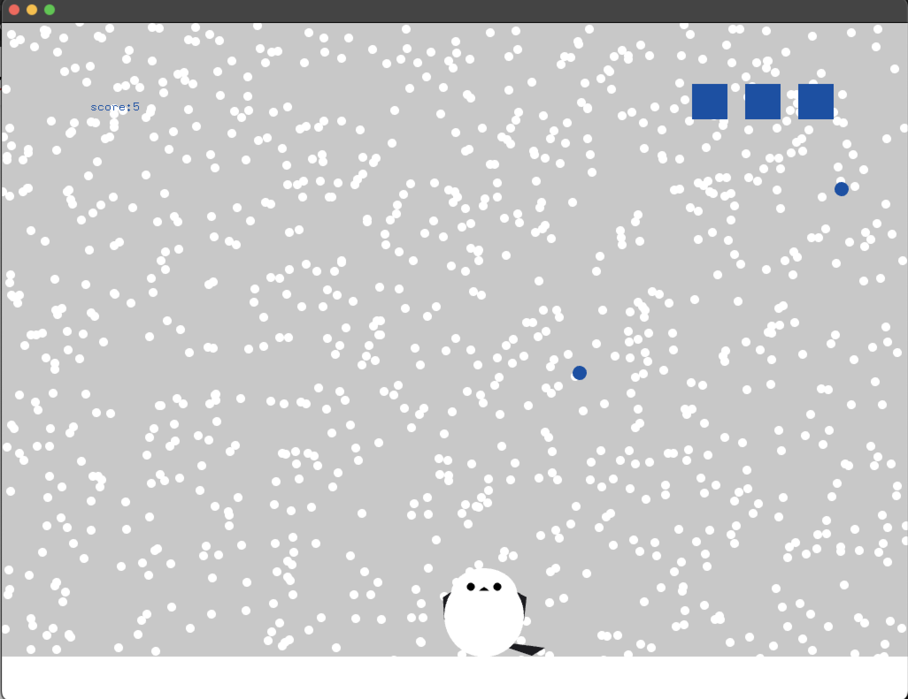

#　 Snow Fairy Ball Avoiding Game

game image

## How to play

- Operate shima to avoid bouncing balls.
- The shima is hit by balls, its life is reduced.
- If you run out of lives, game over!

## method of operation

- moving mouse : shima follows the cursor, left and right.
- press the key of [s] : restart the game
